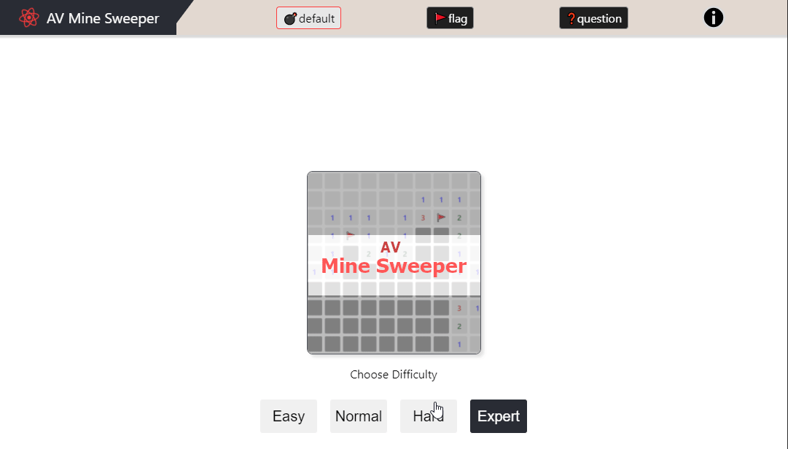
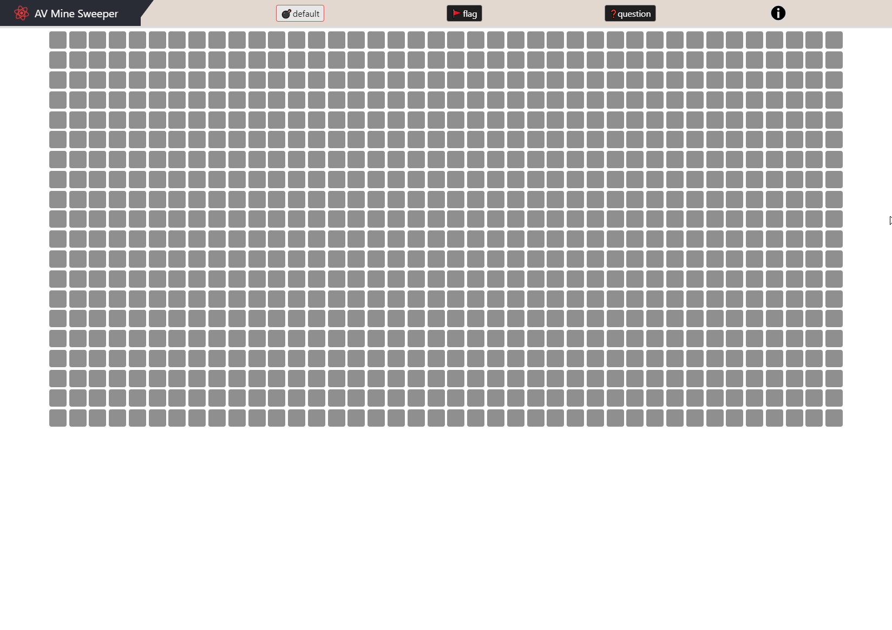
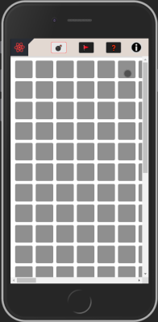

# AV Mine Sweeper

## Description
My home work assignment project from `Evolution Gaming`. 

#### [Demo](https://av-evo-minesweeper.netlify.app/)

## Features
  - 3 modes 💣reveal (default), 🚩 - flag a mine, ❓ - guess (when mine is not 100% there) 
  - responsive layout   
  
  - mobile layout   
  
  - some accessibility  (rem units, mobile friendly (bigger click area), aria-labels)
  - debugging in dev mode

## Technologies Used
* React (CRA boilerplate)
* Typescript
* Web Sockets

## Setup
`npm ci` perform a clean install inside root folder to setup project for
development

## Scripts

### `npm start`
Runs the app in the development mode. 
Development server: [http://localhost:3000](http://localhost:3000) 

### `npm test`
Launches the test runner in the interactive watch mode

### `npm run build`
Builds the app for production to the `build` folder

## TODO
- improve cell drawing performance for expert mode
